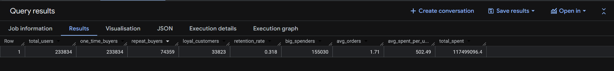
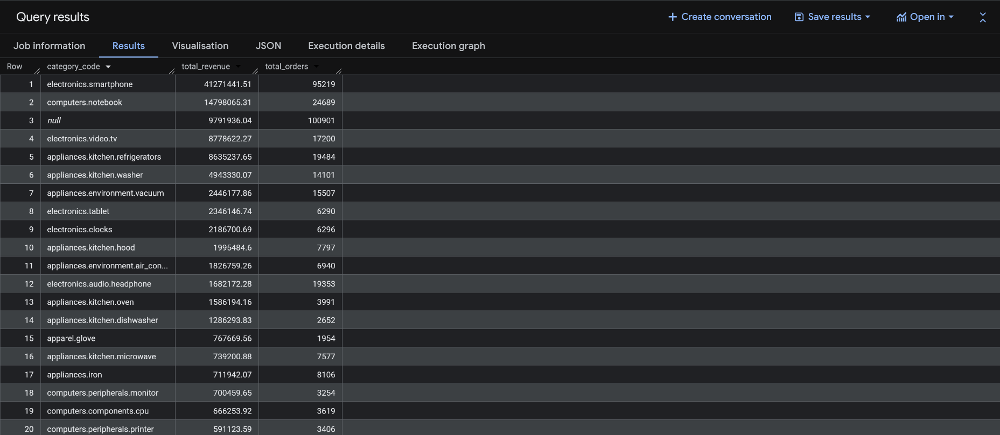
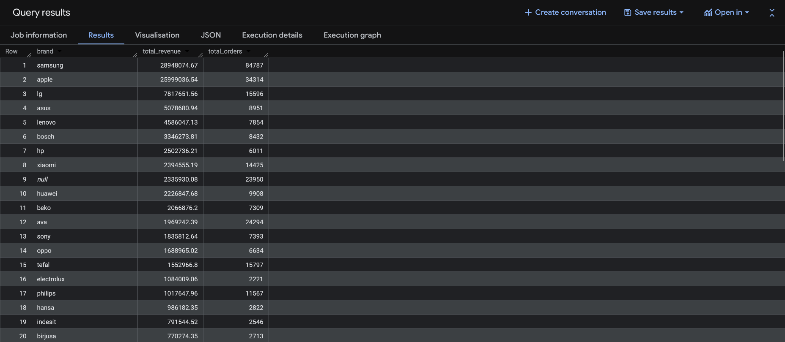
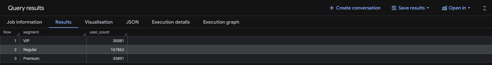
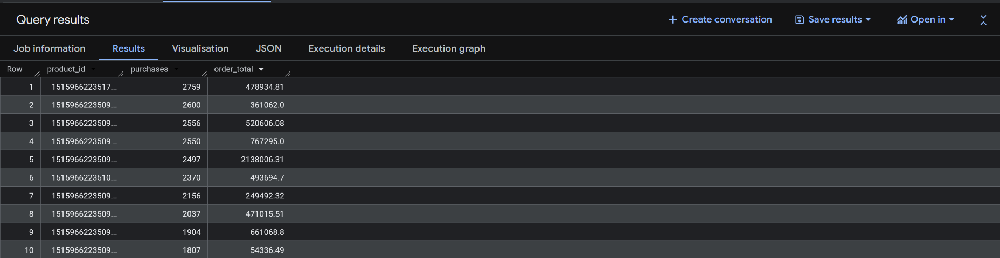
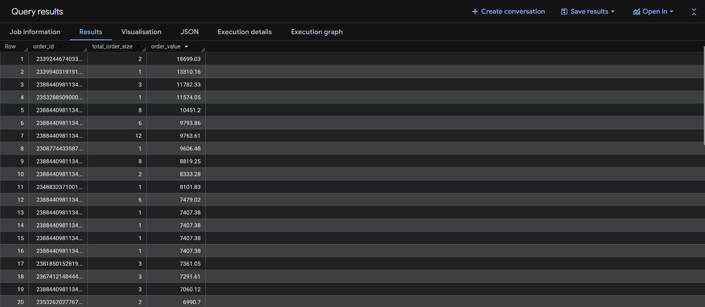
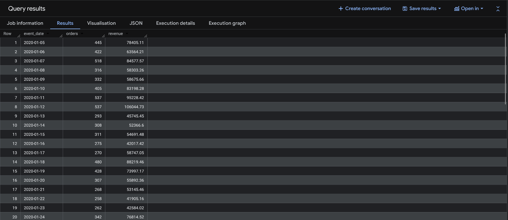
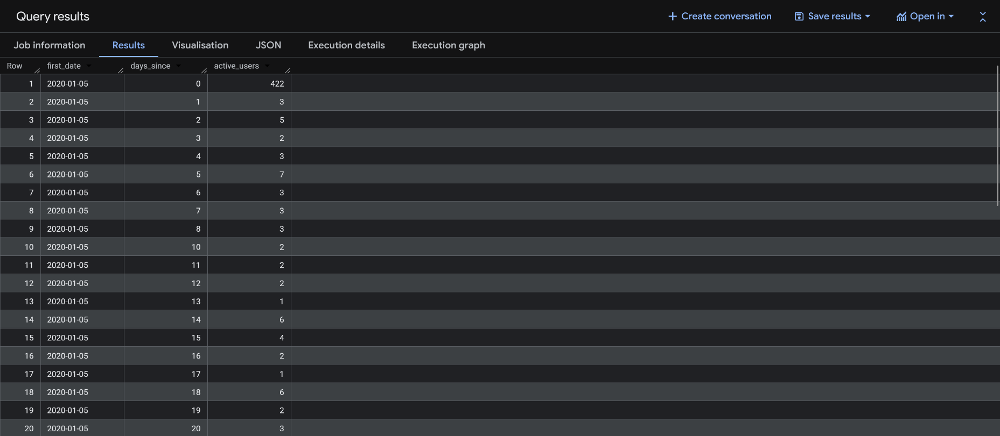
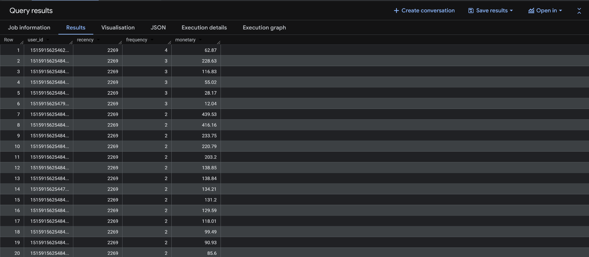

# E-commerce Customer Behavior & Revenue Analysis (BigQuery)

---

## Overview

This project analyzes customer behavior, revenue drivers, and purchasing patterns in an e-commerce electronics dataset using **Google BigQuery**.

The objective is to simulate a real-world data analyst workflow:

* Data ingestion in a cloud warehouse
* Data cleaning and transformation
* SQL-based analysis
* Extraction of business insights

---

## Dataset

E-commerce purchase history (electronics store)

> Kaggle Dataset :- https://www.kaggle.com/mkechinov/ecommerce-purchase-history-from-electronics-store

Contains transaction-level data:

| Column Name       | Description         |
| ------------------| --------------------|
| `event_time`      | Purchase Timestamp  |
| `order_id`        | Order Identifier    |
| `product_id`      | Product Identifier  |
| `category_code`   | Product Category    |
| `brand`           | Product Brand       |
| `price`           | Product Price       |
| `user_id`         | User Identifier     |

---

## Project Structure

```bash
Ecommerce-Market-Funnel-Analysis/
│
├── sql/
│   ├── data_cleaning.sql
│   ├── data_validation.sql
│   ├── customer_buying_behaviour.sql
│   ├── customer_funnel_analysis.sql
│   ├── customer_segmentation.sql
│   ├── retention_analysis.sql
│   ├── rfm_analysis.sql
│   ├── time_series_analysis.sql
│   ├── revenue.sql
│   ├── top_products.sql
│   
├── query results/
├── query_results_csv/
├── README.md
```

---

## Tools & Technologies

* **SQL (Google BigQuery)**
* **Google Cloud Platform (GCP)**
* Data Analysis & Aggregation Techniques

---

## Setup Process (Step-by-Step)

1. **Create Google Cloud Project**

   * Navigate to Google Cloud Console
   * Create a new project

2. **Open BigQuery**

   * Search for BigQuery → Open SQL Workspace

3. **Create Dataset**

   * Name: `ecommerce_funnel_analysis`
   * Set location (e.g., `asia-south1`)

4. **Upload Dataset**

   * Upload CSV file
   * Table name: `events_data`
   * Enable **Auto-detect schema**

5. **Verify Data**

   ```sql
   SELECT event_time FROM ecommerce_analysis.events_data LIMIT 10;
   ```

6. **Data Cleaning**

   * Convert timestamps
   * Remove invalid rows
   * Filter incorrect dates (e.g., 1970 entries)

---

## Data Preparation

```sql
CREATE OR REPLACE TABLE ecommerce_analysis.clean_data AS
SELECT
  event_time,
  DATE(event_time) AS event_date,
  order_id,
  product_id,
  category_id,
  category_code,
  brand,
  SAFE_CAST(price AS FLOAT64) AS price,
  user_id
FROM ecommerce_analysis.events_data
WHERE user_id IS NOT NULL
  AND order_id IS NOT NULL
  AND price IS NOT NULL
  AND DATE(event_time) >= '2020-01-01';
```

---

## Key Analyses & Insights

---

### 🔹 1. Customer Lifecycle Analysis



**Insight:**

* Only **~32% users return** → weak retention
* Majority are **one-time buyers**
* Small loyal segment drives repeat engagement

---

### 🔹 2. Revenue by Category



**Insight:**

* **Smartphones dominate revenue**
* **Laptops and appliances** are major contributors
* Significant revenue in **NULL category** → data quality issue
* Revenue follows **power-law distribution**

---

### 🔹 3. Revenue by Brand



**Insight:**

* **Samsung & Apple dominate the market**
* Apple → high revenue with fewer orders (premium pricing)
* Samsung → high volume + revenue
* Long-tail brands contribute marginal revenue

---

### 🔹 4. Customer Segmentation



**Insight:**

* Majority users are **Regular (low-value)**
* Smaller **Premium & VIP segments** drive most value
* Opportunity to **convert regular users into high-value users**

---

### 🔹 5. Top Products



**Insight:**

* Few products generate **majority of purchases**
* Mix of:

  * **high-volume low-cost items**
  * **low-volume high-ticket items**
* Strong opportunity for **bundling strategies**

---

### 🔹 6. Customer Buying Behavior



**Insight:**

* Most orders contain **1–3 items**
* Some bulk purchases exist but are rare
* High-value orders often come from **expensive single products**

---

### 🔹 7. Time Series Analysis



**Insight:**

* Stable daily demand (~250–550 orders)
* Revenue fluctuates due to **high-ticket purchases**
* Peaks observed → possible promotions or demand spikes
* No strong growth trend → **steady but stagnant business**

---

### 🔹 8. Cohort (Retention) Analysis



**Insight:**

* Sharp drop after first purchase → **low retention**
* Most activity happens in **initial days only**
* Business heavily depends on **new customer acquisition**

---

### 🔹 9. RFM Analysis



**Insight:**

* High recency → many users inactive → churn risk
* Most users have low frequency → weak repeat behavior
* Clear segmentation between **low-value and high-value users**

---

## Overall Business Insights

* Business is **acquisition-driven, not retention-driven**
* Revenue is concentrated among:

  * few categories
  * top brands
  * limited products
* Small segment of **high-value users is critical**
* Product mix combines:

  * volume-driven items
  * premium high-ticket sales

---

## Recommendations

* Improve **customer retention strategies**
* Target **high-value segments (VIP/Premium)**
* Optimize top-performing categories & brands
* Fix **data quality issues (NULL values)**
* Implement **cross-selling and bundling strategies**

---

## Proof of Work

* All queries executed using **Google BigQuery**
* Screenshots of outputs included in `/query results`

---

## Conclusion

This project demonstrates:

* End-to-end SQL analysis in a cloud data warehouse
* Ability to extract meaningful insights from raw transactional data
* Strong understanding of customer behavior and revenue dynamics

---

## Key Takeaway

> This project reflects real-world data analyst responsibilities — combining SQL, cloud tools, and business thinking to drive data-informed decisions.

---

## License

> This project is licensed under the terms of the LICENSE file included in this repository